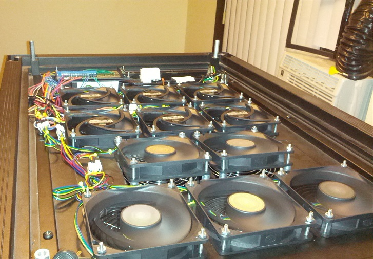

### Purpose

A pwm control software for use with the 7inch official raspberry pi touch screen.
I put this together to control the speed of the fans in my server rack. The fans are on a 12v supply,
and I connected the individual signal inputs using an array of optocouplers I built.

### Main Screen

### Settings Screen

### Touch Keyboard

### FinalInstallation

### Hardware List

Here's the final hardware list I used for my installation:

    The Board:
    [RPi Proto Breadboard PCB Kit](https://www.amazon.com/gp/product/B00WNRYDWE/ref=oh_aui_detailpage_o09_s00?ie=UTF8&psc=1)
    [IDC Ribbon cable](https://www.amazon.com/gp/product/B00XXGOHZW/ref=oh_aui_detailpage_o01_s00?ie=UTF8&psc=1)
    [OptoCouplers](https://www.amazon.com/gp/product/B01GYH74O2/ref=oh_aui_detailpage_o00_s03?ie=UTF8&psc=1)
    [IC Sockets](https://www.amazon.com/gp/product/B01GYLWL6E/ref=oh_aui_detailpage_o00_s02?ie=UTF8&psc=1)
    [Terminal Connectors](https://www.amazon.com/gp/product/B01F7KOM10/ref=oh_aui_detailpage_o00_s01?ie=UTF8&psc=1)
    
    Pi:
    [Raspberry Pi 3](https://www.amazon.com/gp/product/B01CD5VC92/ref=oh_aui_detailpage_o03_s01?ie=UTF8&psc=1)
    [Official Touch Display](https://www.amazon.com/gp/product/B0153R2A9I/ref=oh_aui_detailpage_o00_s03?ie=UTF8&psc=1)
    [SmartiPi touch case](https://www.amazon.com/gp/product/B01HV97F64/ref=oh_aui_detailpage_o00_s00?ie=UTF8&psc=1)
    [Power Supply w On/Off usb cable](https://www.amazon.com/Gowoops-Adapter-Charger-Heatsinks-Raspberry/dp/B01FM0XOH8/ref=sr_1_23?s=pc&ie=UTF8&qid=1480290599&sr=1-23)
    [Testing Keyboard](https://www.amazon.com/Rii-Stainless-Wireless-Rechargable-Raspberry/dp/B00ESUXXZM/ref=sr_1_3?s=pc&ie=UTF8&qid=1480290701&sr=1-3&keywords=rii+keyboard)
    
    Fans:
    [Coolermaster 120](https://www.amazon.com/gp/product/B0030DL37I/ref=oh_aui_detailpage_o00_s00?ie=UTF8&psc=1)
    [4 Pin Extensions](https://www.amazon.com/gp/product/B004PBMPZS/ref=oh_aui_detailpage_o05_s00?ie=UTF8&psc=1)
    [12v power supply](https://www.amazon.com/LEDwholesalers-Power-Adapter-5-5x2-1mm-3228-12V/dp/B003WJ218U/ref=sr_1_11?s=pc&ie=UTF8&qid=1480290530&sr=1-11&keywords=12v+power+supply)
    
    Ducting:
    [Big Gulp Dust collector](https://www.amazon.com/gp/product/B00139DYU0/ref=oh_aui_search_detailpage?ie=UTF8&psc=1)
    [4 inch hose](https://www.amazon.com/gp/product/B005W17RD0/ref=oh_aui_search_detailpage?ie=UTF8&psc=1)
    [4 inch flange](https://www.amazon.com/gp/product/B00DJBXP5E/ref=oh_aui_search_detailpage?ie=UTF8&psc=1)
    [4 wall cap](https://www.amazon.com/gp/product/B0085KZOA8/ref=oh_aui_search_detailpage?ie=UTF8&psc=1)
    [4 inch hose clamp](https://www.amazon.com/gp/product/B001DDY6HG/ref=oh_aui_search_detailpage?ie=UTF8&psc=1)

### A note about pwm fan wiring

From everything that I've deduced in my testing, pwm fans are supposed to go to full speed with just a 12v connection, output a low voltage on the pwm pin, and go to their lowest speed when you ground the pwm pin. Now this runs contrary to the intel specification, and all the documentation I've found about pwm fans. All documentation that I can find talks about SUPPLYING a pulse, but even if you supply a pulse at a higher voltage than the pwm pin is outputting, it doesn't act as if it's receiving a pulse.

So really what you need to do to operate a pwm fan is to ground the pwm signal pin at the desired pulse, and this is what I'm doing with the optocouplers. Every time I pulse the gpio pin on one end of the optocoupler it connects the signal pwm pin the the 12v ground, this has the effect of completely isolating both ends of the circuit and protecting the pi.

Because of this behavior, the floating point numbers that the sliders in my software echo to pi-blaster are inverted. 0.0 is fully on (pwm pin is never connected to ground) 1.0 is fully off (pwm pin is always connected to ground).

I ended up trying out a number of different fan brands during this process, and the electronic implementation of pwm on various fans appears to vary widely. 

    Arctic F12 - output 8v on pwm pin - don't go to low speed when connected to ground
    Noctua Fan F12 pro - output 1.8v on pwm pin - turns completely off when connected to ground
    Coolermaster 120 - output 2.2v on pwm pin - goes to low speed when connected to ground
    Enermax PWM - output 1.3v on pwm pin - goes to low speed when connected to ground

From this I can only deduce that the Arctic fans, Noctua fans, and presumably many other brands are not implemented to spec. If anyone has a better explanation about what I've seen here, or can tell me if I've done something wrong, please let me know. I think that I'm right however, because there's very little information about these things available on the web, leading me to believe that this issue has simply been overlooked.

### Raspbian Installation

Simply download [setup.sh](https://raw.githubusercontent.com/ThomasMcVay/FanControl/master/setup.sh) and run it like so:

    sudo bash setup.sh
    
This script assumes only that you have installed the full version of raspbian, if git is missing it will install it. If you are using this software on an existing raspbian installation, you may want to run the commands in setup.sh individually to ensure the libraries that are installed don't conflict with your existing software.
    
this will clone the necessary repositories into /home/pi/FanControl, install qt, pyside, and my fork of pi-blaster. It will also create a shell script at /home/pi/StartupScript.sh that will run the program on start

The script should work on a fresh raspbian installation, qt installation on a raspberry pi can take upwards of an hour though, so be prepared to do some waiting.